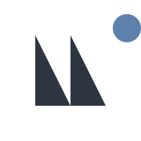
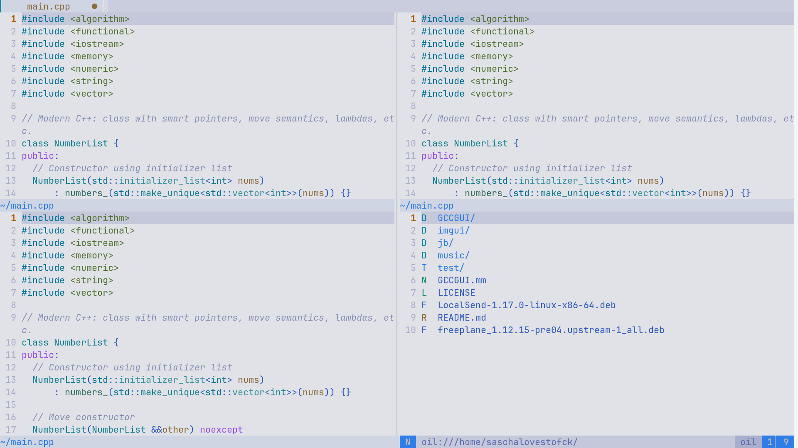
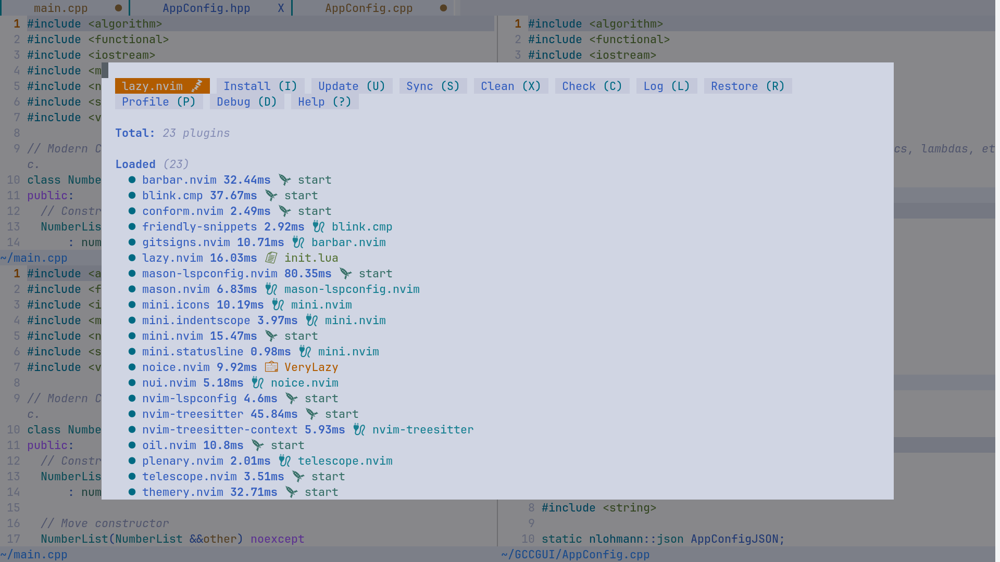

   &nbsp;&nbsp;&nbsp;
  

# NvKitstart

NvKitstart is a modern, object-oriented Neovim starter configuration written in Lua.  
It features modular plugin management via [lazy.nvim](https://github.com/folke/lazy.nvim), sensible defaults, and clear extension points for easy customization and contribution.

---

## Features

- **OOP-style Lua structure** for maintainability and extensibility
- **Plugin management** with [lazy.nvim](https://github.com/folke/lazy.nvim)
- **Fast startup** and automatic bootstrapping
- **LSP, completion, formatting, file explorer, statusline, colorschemes**, and more
- **Easy to add, update, or remove plugins**
- **Contributor-friendly** with clear inline comments and [CONTRIBUTING.md](./CONTRIBUTING.md)
- **MIT licensed**

---

## Getting Started

1. **Requirements**
    - [Neovim](https://neovim.io/) 0.9 or newer
    - [git](https://git-scm.com/)

2. **Installation**
    - Copy `init.lua` into your Neovim config folder:
      - `~/.config/nvim/init.lua` (Linux/macOS)
      - `%USERPROFILE%\AppData\Local\nvim\init.lua` (Windows)
    - Start Neovim – plugins will bootstrap and install automatically!

3. **First Run**
    - NvKitstart will automatically install [lazy.nvim](https://github.com/folke/lazy.nvim) if it is missing.
    - All included plugins and LSP servers will be managed for you.

---

## Customization

- **Add/Remove Plugins:**  
  See the `setup_plugins()` method in `init.lua` for plugin specs.  
  Add a new plugin by appending its spec table to the list.

- **Change Options:**  
  Edit the `set_options()` method to change editor settings.

- **Add Keymaps:**  
  Add keymaps to the relevant plugin spec or by extending the config class.

- **Diagnostics & More:**  
  Extend `setup_diagnostics()` for custom diagnostics.

See [CONTRIBUTING.md](./CONTRIBUTING.md) for more details on customizing and contributing.

---

## Contributing

Pull requests, issues, and suggestions are welcome!  
Please read [CONTRIBUTING.md](./CONTRIBUTING.md) before submitting major changes.

---

## License

MIT License. See [LICENSE](./LICENSE).

---

## Credits

- [lazy.nvim](https://github.com/folke/lazy.nvim) (plugin manager)
- All referenced plugins – see `init.lua` for full list

---

## Screenshots

---

## Questions?

Open an [issue](https://github.com/BillyBoyMF/NvKitstart/issues) or start a discussion!
